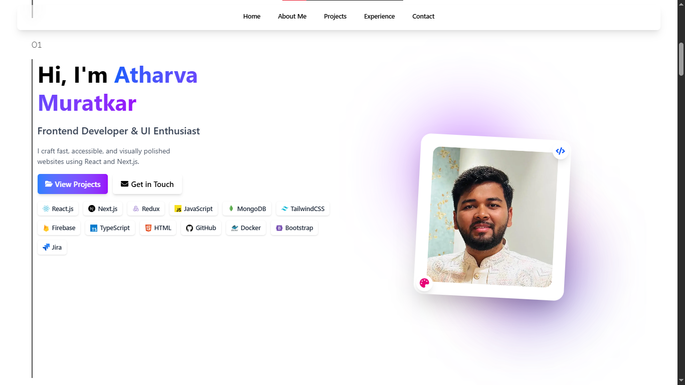
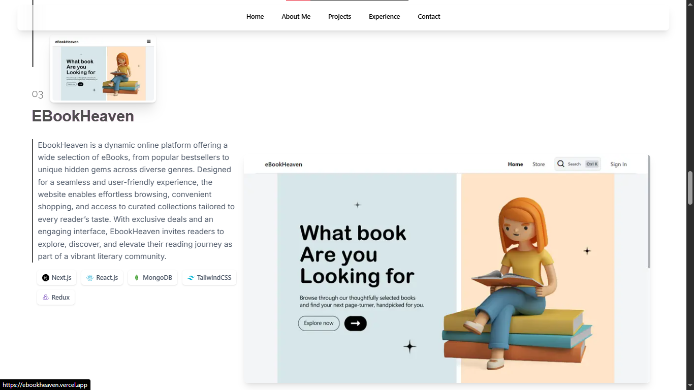

# 🌐 Personal Portfolio Website

This is my **personal portfolio website** built with **Next.js**, **React**, **Tailwind CSS**, and **TypeScript**. It showcases my skills, experience, and selected projects. The goal is to create a professional online presence and demonstrate my frontend development capabilities.


*Preview of the homepage section*

## ✨ Features

- Responsive and accessible design
- Hero section with introduction and contact CTA
- About Me section
- Projects section with dynamically managed data (Firebase/Firestore)
- Experience section
- Contact form (email integration via form handler)
- Resume download
- SEO optimized with metadata and Open Graph tags


*Project listing section dynamically fetched from Firestore*

## 🛠️ Tech Stack

- [Next.js](https://nextjs.org/)
- [React](https://reactjs.org/)
- [Tailwind CSS](https://tailwindcss.com/)
- [TypeScript](https://www.typescriptlang.org/)
- [Firebase](https://firebase.google.com/) (for project data & hosting)

## 🚀 Getting Started

To run the project locally:

```bash
git clone https://github.com/your-username/your-portfolio.git
cd your-portfolio
npm install
npm run dev
```

## 🧪 Scripts

- `npm run dev` – Runs the app in development mode
- `npm run build` – Builds the app for production
- `npm run start` – Starts the production build

## 📁 Folder Structure

```
src/
├── app/
├── components/
├── lib/
```

## 📄 License

This project is licensed under the MIT License.

---

Built with ❤️ by [Your Name](https://yourwebsite.com)
